<!--
  Ömer Kırkan · GitHub profile README
  Theme mirrors omerweb.site — zsh terminal, JetBrains Mono, mint-green (#4ce0a1) on ink (#101317)
-->

 

 

 

 

### `$ whoami`

I'm a fullstack developer who sees software as a means, not an end. I work
across every layer of the **TypeScript**, **JavaScript** and **.NET**
ecosystems — from backend to frontend — with a focus on building scalable,
maintainable systems.

What truly excites me is taking an idea from first thought to finished product
and putting it in front of users — because good software earns its meaning not
on a screen, but when it works in people's lives.

 

### `$ ./stack --list`

**`~/` frontend**

**`~/` backend**

**`~/` mobile**

**`~/` automation &amp; tooling**

 

### `$ git log --oneline ./stats`

 

### `$ ./connect`

**`omerkirkan:~$`** — always open to good conversations and cool projects.

  

<code>© 2026 Ömer Kırkan · compiled with ☕ and a green cursor ▌</code>

